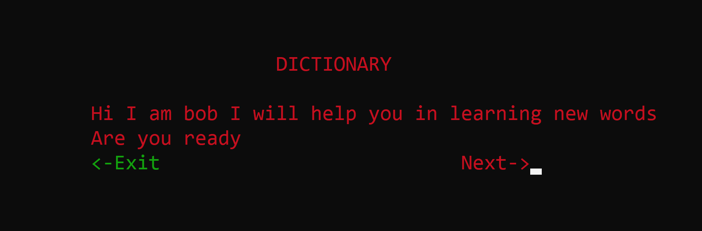
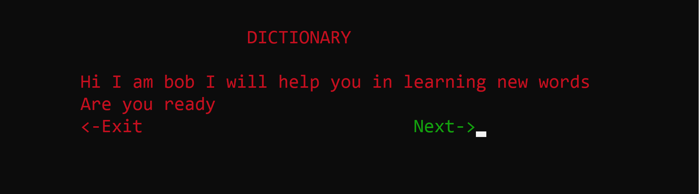
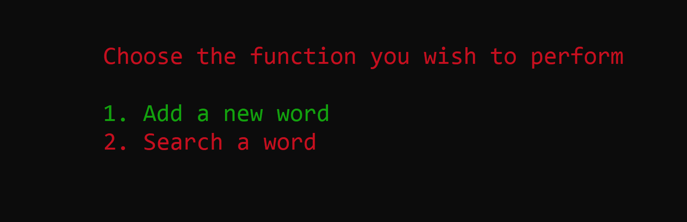
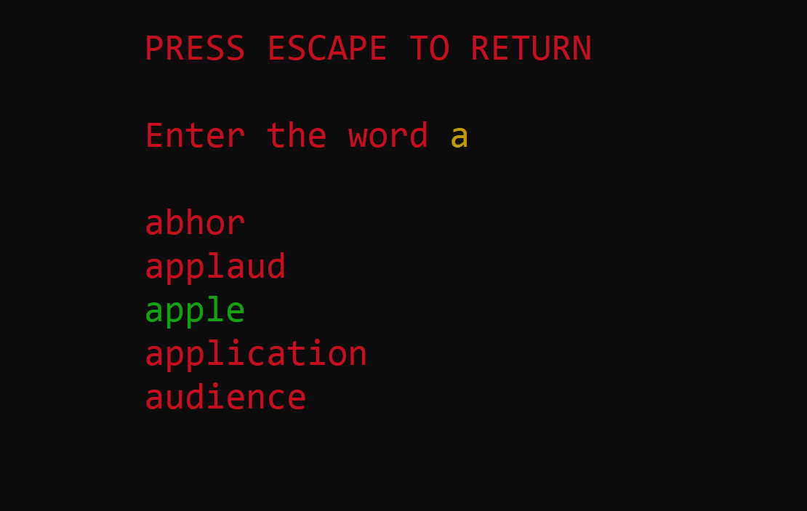
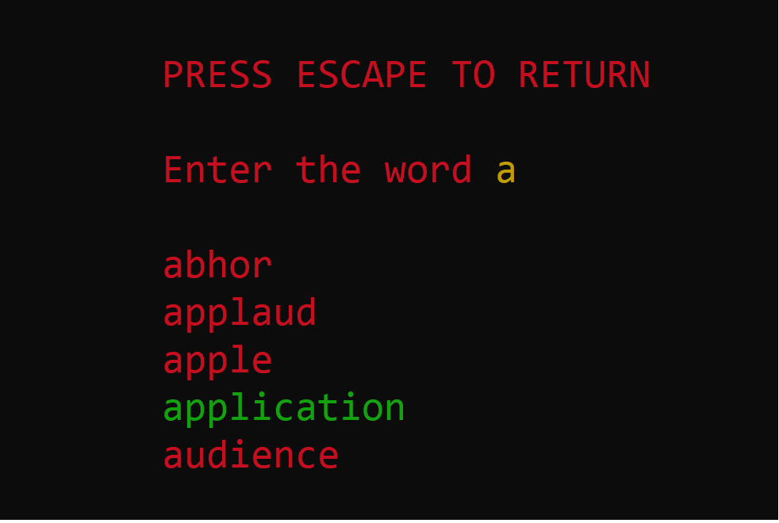
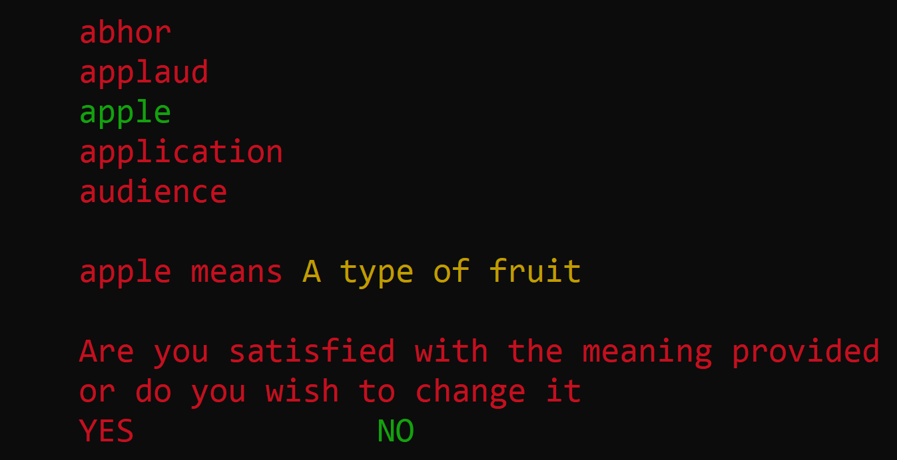

# Dictionary-c-
Dictionary with GUI and TRIE 

This Project is different from traditional projects that are not user-friendly

## Problems in tradtional c++ projects:

1) We have to press numbers for it work that is difficult for non-programmers
2) Very basic just in short just displays the data the user gives without any other functionality

## Notable features in this project

1) Use of arrow-keys for basic navigation with functionality of buttons
2) Easily understood by non-programmers and easy to understand
3) Since it is a dictionary the user gets smart suggestion about what they are try to type this acts auto-complete feature

## HOW TO RUN

Just download all the files in 1 folder and compile the main fil
This code will work on all windows machine perfectly fine

The implementation of all the required data structures can be viewed from the appropriately named cpp files provided here

## SCREENSHOTS

### 1. Homescreen

### 2. Auto-complete/Suggestion

